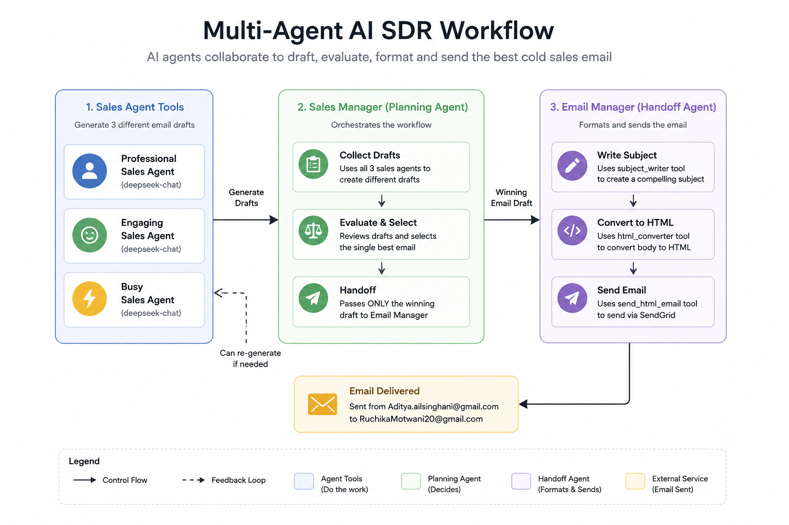
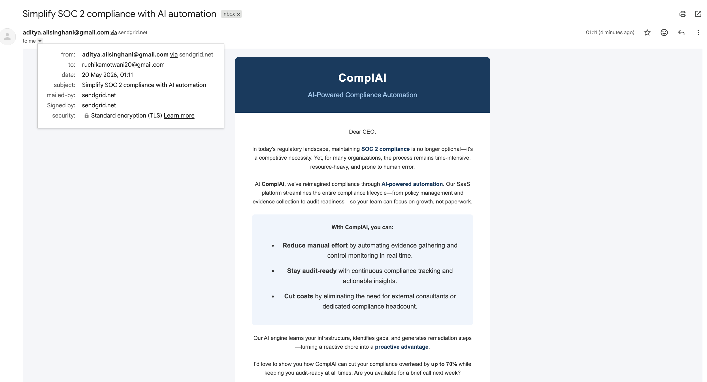
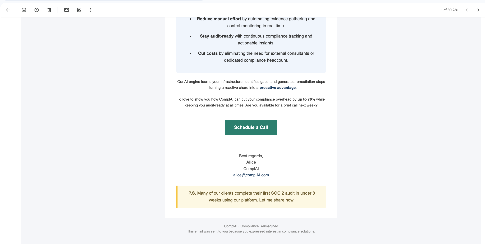

# Multi-Agent AI SDR

A multi-agent AI SDR (Sales Development Representative) workflow that autonomously generates, evaluates, formats, and sends cold sales emails using collaborating AI agents, tool calling, handoffs, async orchestration, DeepSeek models, and SendGrid integration.

---

# Project Overview

This project simulates an autonomous AI SDR pipeline using multiple specialized AI agents working together.

The system:
1. Generates multiple cold sales email drafts
2. Evaluates and selects the strongest version
3. Creates a subject line
4. Converts the email into HTML format
5. Automatically sends the final email using SendGrid

Built while learning:
- Agentic AI workflows
- Multi-agent orchestration
- Tool calling
- Agent handoffs
- Async execution
- External API integrations

---

# Workflow Architecture

<p align="center">
  
</p>

---

# Example Generated Email

## Final Delivered Email

<p align="center">
  
</p>

<p align="center">
  
</p>

---

# Agent Workflow

```text
User Prompt
    ↓
Sales Manager Agent
    ↓
Calls 3 Specialized Sales Agents
    ├── Professional Sales Agent
    ├── Engaging Sales Agent
    └── Concise Sales Agent
    ↓
Evaluates Generated Drafts
    ↓
Selects Best Email
    ↓
Handoff to Email Manager Agent
    ↓
Subject Writer Agent
    ↓
HTML Formatter Agent
    ↓
SendGrid Email Tool
    ↓
Final Email Delivered
```

---

# Key Concepts Demonstrated

## Multi-Agent Collaboration
Multiple specialized agents collaborate inside a single workflow.

## Tool Calling
Python functions are converted into callable AI tools using:

```python
@function_tool
```

## Agent-as-Tool Pattern
Agents themselves are converted into tools using:

```python
agent.as_tool()
```

## Agent Handoffs
The Sales Manager delegates formatting and delivery responsibilities to the Email Manager agent.

## Async Execution
Multiple agents run simultaneously using:

```python
await asyncio.gather(...)
```

## External API Integration
SendGrid is integrated for automated outbound email delivery.

---

# Technologies Used

- Python
- OpenAI Agents SDK
- DeepSeek API
- SendGrid API
- AsyncIO
- dotenv

---

# Models Used

This project uses DeepSeek models through OpenAI-compatible APIs.

```python
base_url="https://api.deepseek.com"
```

The Agents SDK was configured to use Chat Completions mode instead of the OpenAI Responses API.

---

# Repository Structure

```text
multi-agent-ai-sdr/
│
├── notebooks/
│   └── multi_agent_ai_sdr.ipynb
│
├── images/
│   ├── workflow.png
│   ├── email1.png
│   └── email2.png
│
└── README.md
```

---

# Learning Outcomes

This project helped me better understand:
- Agentic AI systems
- Multi-agent workflows
- Tool orchestration
- Handoffs vs tool calling
- Async AI execution patterns
- External API integrations
- Autonomous AI pipelines
- LLM provider abstraction

---

# Future Improvements

- CRM integration
- Retrieval-Augmented Generation (RAG)
- Lead personalization
- Agent memory
- Email analytics tracking
- Human approval workflows
- Prospect research agents

---

# Disclaimer

This project was built for educational purposes while exploring autonomous multi-agent AI systems and agentic workflows.
